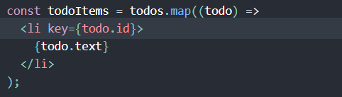

<h1>React-Interview-Prep</h1>
This Repository is an open source, detailing Must know concepts of React and most interview Questions

<h3>Why use React instead of other Frameworks like Angular?</h3>
<ol>
  <li>Easy creation of dynamic applications. React makes it easier to create dynamic applications because it provided less coding and provides more functionality, whereas with Javascript applications, code tends to be complex very quickly</li>
  <li>Reusable components. Components are the building blocks of any React application, a single app consists of multiple components. These components have their own logic and controls and can be reused through the application, which in turn, dramatically reduces the development time of an application</li>
  <li>Dedicated tools for easy debugging: Facebook released a chrome extension that can be used to debug React applications</li>
</ol>
<h2>JSX</h2>

<h3 style="color:red;">What is JSX in React?</h3>

JSX is a  Javascript Extension Syntax used in React to easily write HTM and JavaScript together.

<h3>Can web browsers read JSX directly</h3>

Web browsers cannot read JSX directky. This is because they are built to only read regular JS objects and JSX is not a regular Javascript object. For the web browser to read a JSX file, the file needs to be transformed into a regular Javascript object. For this we use Babel

## Keys

Keys help React identify which items have changed, are added, or are removed. Keys should be given to the elements inside the array to give the elements a stable identity.

The best way to pick a key is to use a string that uniquely identifies a list amoung its siblings. Most oftn you would use IDs from your data as keys

## <h3>What is a DOM in React React JS?</h3>

DOM stands for Document Object Model. It is a structured representation of the HTML elemets that are present in a web page or web-app. DOM represents the entire UI of your application. It is an interface that allows the script to update the content, style and the structure of the document

<h3>What is the differenct between Virtual DOM and Real DOM?</h3>
<ul>
  <li>Real DOM is very Expensive while Virtual DOM is very easy</li>
  <li>In Real DOM, there is too much memory wastage while in Virtual DOM, there is no memory wastage</li>
  <li>Real DOM updates slow while Virtual DOM updates fast</li>
  <li>Real DOM can directly update HTML while Virtual DOM can't directly update HTML</li>
  <li>Real DOM Creates a new DOM if the element updates while Virtual DOM updatess the JSX if the element updates</li>
</ul>

### Features of React
<h3>List React Features and their explanation</h3>
<ol>
  <li>JSX - This is a javascript extension in react that is used HTML and Javascript together</li>
  <li>Unidirectional Data Flow and Flux - React is designed that it will only support data that is flowing downstream, in one direction. If the data has to flow in another direction, it will need additional features</li>
  <li>Virtual DOM - React contains a lightweight representation of the real DOM in the memory called Virtual DOM. Manipulating the Real DOM is much slower compared to VDOM as nothing gets drawn on the screen.</li>
  <li>Extensions. React supports various extensions for the application. It supports server-side rendering, Flux, and Redux for creating cross-compatible mobile apps</li>
  <li>Debugging - Testing React apps is very easy due to large community support.</li>
</ol>

### Component
<h3>What is a Component in React?</h3>

Components are independent and reusable bits of code. They serve the same purpose as Javascript functions but work in isolation and return HTML

<h3>What is the difference between functional components and class components</h3>
<ol>
  <li>Functional Components have no state of their own and only contain render methods. The are also called stateless components. They derive data from other components props</li>
  <li>Class Components can hold and manage their own state and have separate render method to return JSX on the screen. They are also referred to as Stateful components</li>
</ol>
<h3>What is the use of render?</h3>

Is it a requirement for each component to have a render function. This function returns the HTML which is to be displayed in the component.

if you need to render more than one element, all the elements need to be under one parent tag

